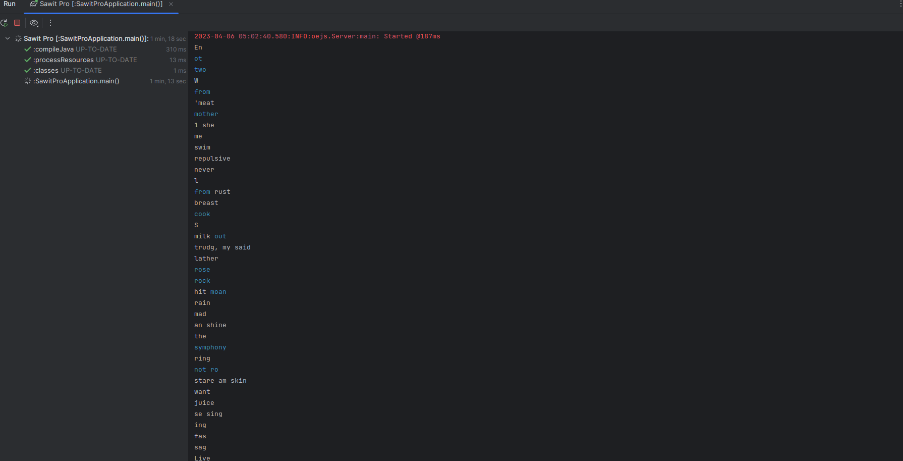
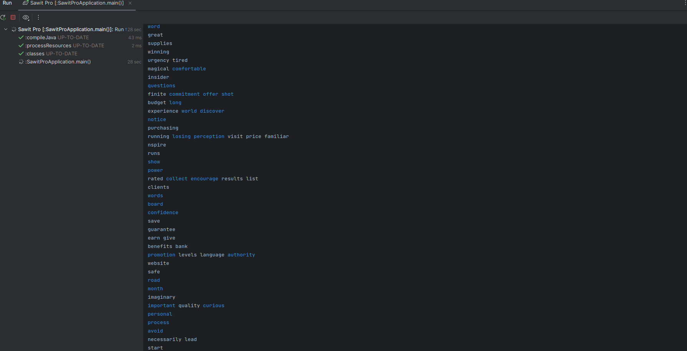
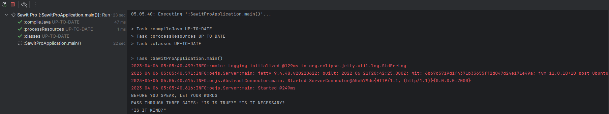
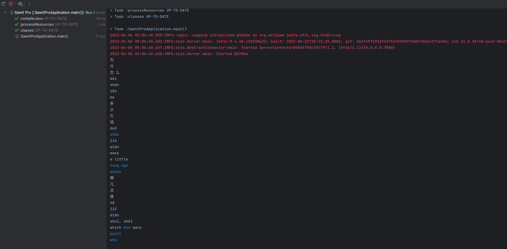

# Requirements
- Java 11
- Gradle 7.6.1

# Installation
- Build `./gradlew build`
- Run `./gradlew run`

# API Request
- Method: POST
- URL: localhost:7000/ocr?filename=%s. ex: `localhost:7000/ocr?filename=ImageWithWords1.jpg`

# Output Files
- [ImageWithWords1.jpg-chinese.html](https://github.com/wahyukodar/Sawit-Pro-Test/blob/master/ImageWithWords1.jpg-chinese.html)
- [ImageWithWords1.jpg-english.html](https://github.com/wahyukodar/Sawit-Pro-Test/blob/master/ImageWithWords1.jpg-english.html)
- [ImageWithWords2.png-chinese.html](https://github.com/wahyukodar/Sawit-Pro-Test/blob/master/ImageWithWords2.png-chinese.html)
- [ImageWithWords2.png-english.html](https://github.com/wahyukodar/Sawit-Pro-Test/blob/master/ImageWithWords2.png-english.html)
- [ImageWithWords3.jpg-chinese.html](https://github.com/wahyukodar/Sawit-Pro-Test/blob/master/ImageWithWords3.jpg-chinese.html)
- [ImageWithWords3.jpg-english.html](https://github.com/wahyukodar/Sawit-Pro-Test/blob/master/ImageWithWords3.jpg-english.html)
- [ImageWithWords4.jpg-chinese.html](https://github.com/wahyukodar/Sawit-Pro-Test/blob/master/ImageWithWords4.jpg-chinese.html)
- [ImageWithWords4.jpg-english.html](https://github.com/wahyukodar/Sawit-Pro-Test/blob/master/ImageWithWords4.jpg-english.html)

# Screens Shoots

